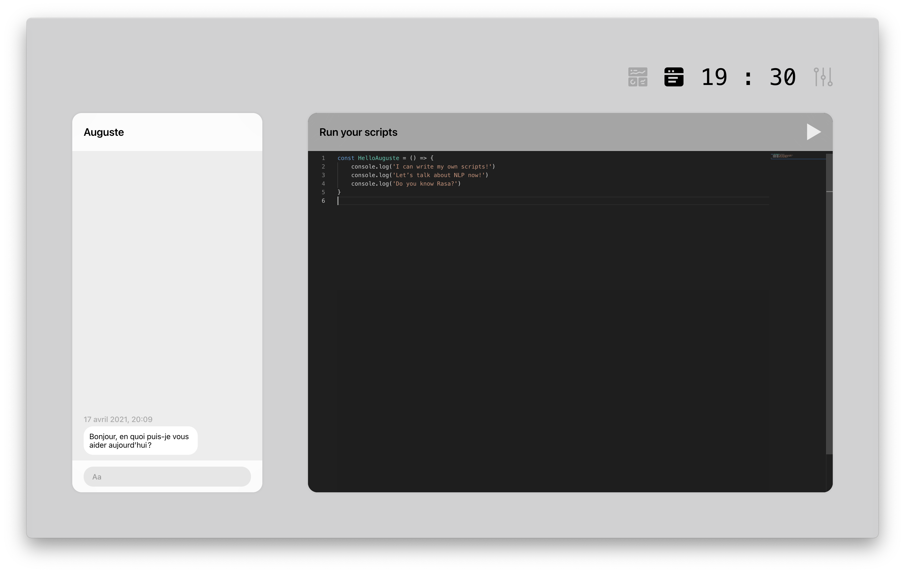
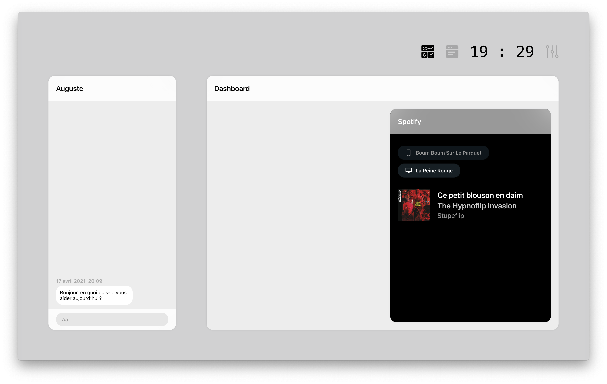

# Auguste

Auguste is made to automate your boring tasks, and to help you in your developer day-to-day life. Auguste is a new chatbot, running fully in local, not in the cloud. It is extendable and you can yourself add everything you want, directly into the engine.

With a full fledged text editor directly built-in, you can use it to write your script, and run it in Auguste, all with a hotkey.

You can control your Spotify account, directly from within the chatbot.
